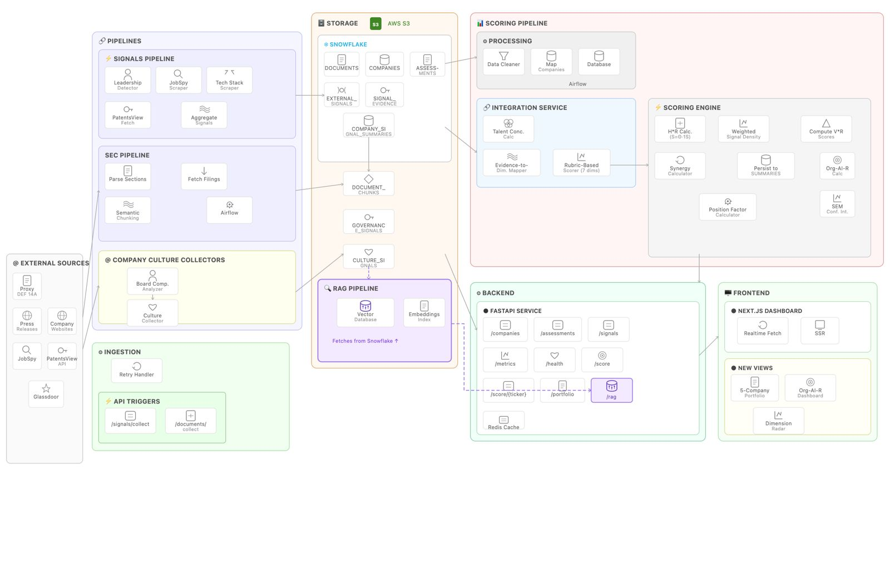

# PE Org-AI-R Platform 🚀
> **Enterprise-Grade Intelligence Engine for Private Equity AI Due Diligence**


The **PE Org-AI-R Platform** is a sophisticated data orchestration and analytics platform engineered to help Private Equity firms assess the technological maturity and AI readiness of target portfolio companies. The system automates the capture of high-fidelity signals from SEC filings, global patent registries, technology job markets, and **Glassdoor employee reviews** to compute a multi-dimensional AI-readiness score. **Case Study 4** extends the platform with a **Retrieval-Augmented Generation (RAG) Search Engine** — combining ChromaDB vector search, BM25 sparse retrieval, and a multi-provider LLM router (LiteLLM) to transform evidence into professional, citation-backed IC Meeting Packages.

---

## 🛠 Technology Stack & Core Dependencies

| Layer | Technologies & Frameworks |
| :--- | :--- |
| **Frontend** |  **Next.js 15 (App Router)**, **TypeScript**, **Tailwind CSS**, **Lucide React** |
| **Backend** |  **FastAPI**, **Pydantic V2**, **Structured Logging (structlog)**, **Tenacity (Retry Logic)** |
| **Data & Cache** |  **Snowflake (SQL Alchemy + Snowflake-connector)**,  **Redis (aioredis)** |
| **Orchestration** |  **Apache Airflow 2.x** (TaskFlow API, Dynamic Task Mapping) |
| **Pipelines** |  **Playwright (Stealth Mode)**, **JobSpy (LinkedIn Scraper)**, **Wextractor (Glassdoor API)**, **Boto3 (AWS S3)** |
| **RAG & Vector Search** | **ChromaDB** (Persistent HNSW cosine index), **text-embedding-3-small** (via LiteLLM), **BM25Okapi** (`rank-bm25`), **HyDE** query expansion |
| **LLM Routing** | **LiteLLM** (`acompletion`) — multi-model async router (GPT-4o primary, Claude-3.5-Sonnet fallback) with `$50/day` budget cap |
| **Reverse Proxy** |  **Nginx** (unified gateway for API + Frontend + Docs) |
| **Testing** |  **Pytest**, **Asyncio In-Memory Testing** |

---

## 📚 Documentation & Resources
*   **Codelabs Guide**: [Detailed Step-by-Step Walkthrough](https://codelabs-preview.appspot.com/?file_id=1ZMZQVoVryvtwnCxgK_-nMqgqGZELZYVzpC4K1OSTRy8#6)
*   **Codelab Documentation**: [Project Technical Manual](https://docs.google.com/document/d/1ZMZQVoVryvtwnCxgK_-nMqgqGZELZYVzpC4K1OSTRy8/edit?usp=sharing)
*   **Video Demonstration**: [Full Platform Walkthrough](https://drive.google.com/file/d/1Vr77ca3YGzqyzr5XXE_Sezia3PEuSRI6/view?usp=sharing)
*   **Architecture Diagram**:
    

---

## 📂 Project Structure
```text
.
├── pe-org-air-platform/         # Core platform implementation
│   ├── .env                    # Environment credentials
│   ├── .env.example            # Environment template
│   ├── docker/                 # Deployment infrastructure
│   │   ├── Dockerfile          # Multi-stage platform build
│   │   ├── docker-compose.yml  # Full-stack orchestration
│   │   └── nginx.conf          # Reverse proxy routing
│   ├── dags/                   # Airflow DAG definitions
  |app
  |--|routers
  |--|--|metrics.py                   # Dashboard & readiness report metrics
  |--|--|signals.py                   # External signals & Glassdoor endpoints
  |--|--|rag.py                       # RAG API Gateway (/ingest, /query, /notes/*)
  |--|--|justify.py                   # IC Meeting Package endpoint (/justify)
│   ├── app/                    # FastAPI application source
│   │   ├── config.py           # Application settings (Pydantic V2)
│   │   ├── database/           # SQL schemas and seed data
│   │   │   ├── schema.sql      # Core company & assessment tables
│   │   │   ├── schema_culture.sql # Glassdoor scoring schema
│   │   │   └── seed.sql        # Calibration data (Bases, Industry)
│   │   ├── models/             # Pydantic & Data Models
│   │   │   └── rag.py          # CS1–CS4 models (CS2Evidence, ScoreJustification, ICMeetingPackage)
│   │   ├── pipelines/          # Data collection & analysis logic
│   │   │   ├── integration_pipeline.py # Orchestrator
│   │   │   ├── board_analyzer.py # CS3 Board analyzer
│   │   │   └── glassdoor/      # Culture signal collector
│   │   ├── routers/            # API endpoints
│   │   ├── scoring/            # Core Readiness Engine
│   │   │   ├── calculators.py  # V^R, H^R, Synergy
│   │   │   └── position_factor.py # Screenshot-compliant logic
│   │   └── services/           # DB, Cache, Sector config
│   │       ├── llm/router.py          # Multi-provider LLM router (LiteLLM + DailyBudget)
│   │       ├── search/vector_store.py # ChromaDB vector store
│   │       ├── search/ingestion.py    # IngestionService (Snowflake → ChromaDB)
│   │       ├── retrieval/hybrid.py    # Hybrid retriever (BM25 + Dense + RRF)
│   │       ├── retrieval/hyde.py      # HyDE query expansion
│   │       ├── retrieval/dimension_mapper.py # Signal-to-Dimension mapping
│   │       ├── integration/cs1_client.py     # SDK wrapper — Company/Industry
│   │       ├── integration/cs2_client.py     # SDK wrapper — Signals/Evidence
│   │       ├── integration/cs3_client.py     # SDK wrapper — Assessments/Metrics
│   │       ├── collection/analyst_notes.py   # Analyst notes ingestion
│   │       ├── justification/generator.py    # ~150-word PE memo generator
│   │       └── workflows/ic_prep.py          # IC Meeting Package workflow
│   ├── frontend/               # Next.js 15 Intelligence Dashboard (App Router)
   ├── tests/                  # Pytest suite (21+ modules)
   └── pyproject.toml          # Core dependencies
└── Prototyping/                # Research & Scratches
```

---

## 🚀 Deployment & Installation

### 1. Requirements & Prerequisites
*   **Docker Desktop** (with Compose V2)
*   **Snowflake Account** (With `ACCOUNTADMIN` or equivalent to create tables)
*   **OpenAI API Key** (Required for CS4 RAG — embeddings and GPT-4o completions)
*   **AWS S3 Bucket** (Optional: for unstructured filing storage)
*   **PatentsView API Key** (Optional: for innovation activity signals)
*   **Wextractor API Key** (Optional: for Glassdoor review collection)
*   **Anthropic API Key** (Optional: Claude fallback in LLM router)

### 2. Environment Setup
Configure your `.env` file in the `pe-org-air-platform` directory. This file is critical as it contains Snowflake credentials, Airflow configuration, and external API keys.

```bash
cd pe-org-air-platform
cp .env.example .env
nano .env
```

**Required Configuration:**
```bash
# === Snowflake Settings ===
SNOWFLAKE_ACCOUNT="your-org-your-account"
SNOWFLAKE_USER="your-user"
SNOWFLAKE_PASSWORD="your-password"
SNOWFLAKE_DATABASE="PE_ORGAIR"
SNOWFLAKE_SCHEMA="PUBLIC"
SNOWFLAKE_WAREHOUSE="your-warehouse"
SNOWFLAKE_ROLE="ACCOUNTADMIN"

# === Application ===
SECRET_KEY="your-secret-key"
AIRFLOW_UID=501

# === Infrastructure ===
REDIS_HOST="redis"
NEXT_PUBLIC_API_URL="http://localhost:8000"

# === External Integration (Optional) ===
AWS_ACCESS_KEY_ID="your-key"
AWS_SECRET_ACCESS_KEY="your-secret"
AWS_REGION="us-east-1"
S3_BUCKET="pe-intelligence-parsed"
PATENTSVIEW_API_KEY="your-patentsview-key"
WEXTRACTOR_API_KEY="your-wextractor-key"

# === CS4 RAG (Required for RAG features) ===
OPENAI_API_KEY="sk-..."
ANTHROPIC_API_KEY="sk-ant-..."
```

### 3. Build and Launch
From the `pe-org-air-platform` directory, run:

```bash
docker compose --env-file .env -f docker/docker-compose.yml up --build
```

All services are accessible through **Nginx reverse proxy** on a single port:

*   **Platform (Unified Entry)**: `http://localhost` — Nginx routes to the appropriate service
*   **Interactive API Docs (Swagger)**: `http://localhost/docs`
*   **Airflow UI**: `http://localhost:8080`

> **Nginx Routing Rules:**
> | Path | Routed To |
> | :--- | :--- |
> | `/api/*` | FastAPI backend (`:8000`) |
> | `/docs`, `/openapi.json` | Swagger/OpenAPI UI (`:8000`) |
> | `/*` (everything else) | Next.js frontend (`:3000`) |

### 4. Docker Services Architecture

The platform runs as a **multi-container stack** orchestrated by Docker Compose:

| Service | Image / Build | Exposed Port | Purpose |
| :--- | :--- | :--- | :--- |
| **nginx** | `nginx:latest` | `:80` | Reverse proxy — single entry point for all traffic |
| **api** | Custom (Airflow base) | Internal `:8000` | FastAPI backend with all REST endpoints |
| **frontend** | Custom (Next.js) | Internal `:3000` | Next.js 15 frontend application |
| **airflow-webserver** | Custom (Airflow base) | `:8080` | Airflow UI for DAG management |
| **airflow-scheduler** | Custom (Airflow base) | — | DAG scheduling & task execution |
| **airflow-triggerer** | Custom (Airflow base) | — | Deferred task triggering |
| **postgres** | `postgres:13` | — | Airflow metadata database |
| **redis** | `redis:latest` | — | Caching layer & Airflow broker |

### 5. Stopping and Cleanup

**Stop containers and remove images (Recommended):**
```bash
docker compose --env-file .env -f docker/docker-compose.yml down --rmi all
```
> **Note:** This preserves your data in `./data/` and `./logs/` directories.

**Complete cleanup (includes volumes):**
```bash
# ⚠️ WARNING: This removes Redis data, Airflow metadata, and all volumes
docker compose --env-file .env -f docker/docker-compose.yml down --rmi all --volumes
```

**Periodic maintenance (recommended weekly):**
```bash
docker system prune -a -f
docker builder prune -f
```

---

## 📡 API Reference

The platform exposes a comprehensive REST API via **FastAPI** with 13 routers. Full interactive documentation is available at **`http://localhost/docs`** (Swagger UI) and **`http://localhost/openapi.json`** (OpenAPI spec).

### Endpoint Overview

| Router | Prefix | Endpoints | Description |
| :--- | :--- | :--- | :--- |
| **Health** | `/health` | `GET /health` | Dependency health check (Snowflake, Redis, S3 status) |
| **Companies** | `/api/v1/companies` | `POST /` `GET /` `GET /{id}` `PUT /{id}` `DELETE /{id}` `GET /{id}/signals/{category}` `GET /{id}/evidence` | Full CRUD, per-company signals by category, and evidence lookup |
| **Assessments** | `/api/v1` | `POST /assessments` `GET /assessments` `GET /assessments/{id}` `PATCH /assessments/{id}/status` `POST /assessments/{id}/scores` `GET /assessments/{id}/scores` `PUT /scores/{id}` | Assessment lifecycle management with dimension scoring |
| **SEC Documents** | `/api/v1/documents` | `POST /collect` `POST /collect-airflow` `GET /` `GET /{id}` `GET /{id}/chunks` | SEC filing collection (direct + Airflow trigger), document & chunk retrieval |
| **Signals** | `/api/v1/signals` | `POST /collect/glassdoor` `GET /culture/{ticker}` `GET /culture/reviews/{ticker}` `POST /collect` `GET /` `GET /evidence` `GET /summary` `GET /details/{category}` | External intelligence collection, Glassdoor reviews & culture scores, signal browsing |
| **Evidence** | `/api/v1/evidence` | `POST /collect` `POST /backfill` `GET /stats` | Batch evidence collection, full portfolio backfill, progress stats |
| **Integration** | `/api/v1/integration` | `POST /run` `POST /run-airflow` | Deep scoring pipeline (direct execution or Airflow DAG trigger) |
| **Metrics** | `/api/v1/metrics` | `GET /industry-distribution` `GET /company-stats` `GET /signal-distribution` `GET /summary` `GET /readiness-report` | Dashboard analytics & AI readiness leaderboard |
| **Industries** | `/api/v1/industries` | `GET /` | List supported industries with risk factors |
| **Config** | `/api/v1/config` | `GET /vars` `GET /dimension-weights` | Non-sensitive platform configuration & scoring dimension weights |
| **RAG Search** | `/api/v1/rag` | `POST /ingest` `POST /query` `POST /notes/ingest` `POST /notes/batch` `GET /notes/{ticker}` `POST /index-airflow` `POST /complete-pipeline` `GET /health` | RAG evidence ingestion, hybrid search, analyst notes, and end-to-end pipeline |
| **IC Justification** | `/api/v1` | `POST /justify` `GET /justify/health` | Full IC Meeting Package with per-dimension PE memos and Buy/Hold/Pass recommendation |
| **System Testing** | `/api/v1/system` | `POST /run-tests` | Trigger the full pytest suite from the API and return results |

### Airflow DAG Trigger Endpoints

| Endpoint | DAG Triggered | Description |
| :--- | :--- | :--- |
| `POST /api/v1/documents/collect-airflow` | `sec_filing_ingestion` | Triggers SEC filing download, parsing, and Snowflake persistence |
| `POST /api/v1/integration/run-airflow` | `integration_pipeline` | Triggers the full OrgAIR scoring pipeline per ticker via Airflow |
| `POST /api/v1/rag/index-airflow` | `pe_evidence_indexing` | Triggers nightly RAG evidence indexing into ChromaDB |

---

## 🔄 Airflow Pipeline Orchestration & Resilience

The platform leverages **Apache Airflow 2.x** with the **TaskFlow API** and **Dynamic Task Mapping** to orchestrate all data collection and scoring pipelines.

### **The Backend-Airflow Bridge (Singleton Pattern)**
Unlike traditional Airflow setups, this platform treats Airflow as a **high-scalability worker pool**:
*   **REST Trigger Mechanism**: The FastAPI backend acts as a singleton gateway. When a user creates an assessment, the backend validates the request and invokes the Airflow REST API to trigger the `integration_pipeline` DAG.
*   **Dynamic Task Mapping (`.expand()`)**: The core scoring pipeline uses dynamic mapping to process N companies in parallel. Each company is encapsulated in a `MappedTaskGroup`, ensuring isolation and concurrency.
*   **Graceful Failure**: Tasks use `TriggerRule.ALL_DONE`. If the Glassdoor scraper fails due to a rate limit, the SEC and Patent analysis still complete, allowing the system to compute a "Partial Score" with a lowered confidence interval.
*   **Shared Volume Analytics**: Heavy XCom payloads (like 10-K filing chunks) are stored in a shared Docker volume (`./data/sec_downloads`), bypassing the Airflow metadata DB to maintain peak performance.

### DAG Overview

| DAG ID | Schedule | API Trigger | Description |
| :--- | :--- | :--- | :--- |
| `integration_pipeline` | `@daily` | `POST /api/v1/integration/run-airflow` | **Core scoring pipeline** — fetches active tickers, then for each company runs parallel analysis tasks (SEC rubric, Board composition, Talent signals, Culture/Glassdoor) and computes the final OrgAIR score. |
| `sec_filing_ingestion` | `@daily` | `POST /api/v1/documents/collect-airflow` | **SEC ingestion** — downloads latest 10-K/10-Q filings per ticker from EDGAR, parses and chunks documents, stores in S3 + Snowflake. |
| `sec_backfill` | Manual | — | **SEC backfill** — manually triggered to backfill historical filings for specified tickers with configurable filing types and limits. |
| `sec_quality_monitor` | `@weekly` | — | **Data quality audit** — validates Snowflake document/chunk counts, checks S3 consistency, and flags zero-chunk documents (parsing failures). |
| `pe_evidence_indexing` | `@daily (2 AM)` | `POST /api/v1/rag/index-airflow` | **RAG indexing** — fetches unindexed CS2 evidence from Snowflake, indexes into ChromaDB + BM25, marks records as indexed to prevent re-processing. |

### Integration Pipeline Workflow
```
fetch_tickers ──► [Per Company (Dynamic Map)] ──►
                   ├── init_assessment
                   ├── analyze_sec       ─┐
                   ├── analyze_board      ├──► finalize_score
                   ├── analyze_talent     │
                   └── analyze_culture   ─┘
```

### SEC Ingestion Workflow
```
get_tickers ──► download_filings (mapped) ──► discover_filings ──► process_filing (mapped) ──► save_to_snowflake (mapped) ──► cleanup
```

---

## 🏢 Glassdoor Culture Scoring

The platform incorporates **Glassdoor employee reviews** as a cultural signal dimension for AI-readiness assessment. Reviews are collected via the **Wextractor API**, scored using a **keyword-based rubric**, and aggregated with **recency and employment-status weighting**.

### Review Collection
*   Reviews are fetched from Glassdoor for target companies (e.g., NVDA, JPM, WMT, GE, DG) using the Wextractor API.
*   Raw review JSON is **cached in S3** to avoid redundant API calls during re-runs.
*   Parsed review objects include: rating, title, pros/cons text, review date, and employment status.

### Rubric-Based Scoring
The `RubricScorer` evaluates reviews across **three culture dimensions**, each scored 1–5:

| Dimension | What It Measures | Example Positive Keywords | Example Negative Keywords |
| :--- | :--- | :--- | :--- |
| **Innovation** | Creativity & forward-thinking culture | *"cutting-edge"*, *"encourages new ideas"*, *"creative freedom"* | *"resistant to change"*, *"outdated tools"*, *"bureaucratic"* |
| **Leadership** | Quality of management vision & support | *"empowering leadership"*, *"clear vision"*, *"mentorship"* | *"micromanagement"*, *"poor communication"*, *"no direction"* |
| **Adaptability** | Organizational agility & responsiveness | *"fast-paced"*, *"embraces change"*, *"agile processes"* | *"slow decision-making"*, *"rigid structure"*, *"stagnant"* |

### Weighted Aggregation
Scores are **not simple averages** — each review is weighted by recency and employment status. The final per-dimension score is computed as a **weighted average**, and keyword evidence is stored alongside scores for audit transparency.

### Data Storage
*   Scores are persisted to Snowflake using the `schema_culture.sql` schema.
*   The `glassdoor_queries.py` module contains `MERGE INTO` statements to handle upserts and prevent duplication.

---

## 🔍 RAG Search Engine (CS4)

Case Study 4 adds a **Retrieval-Augmented Generation (RAG) layer** on top of the existing evidence collection pipelines. Evidence from SEC filings, external signals, and analyst notes is indexed into a hybrid search system and used to generate professional investment memos.

### Evidence Ingestion & Retrieval
*   `POST /api/v1/rag/ingest?ticker=NVDA` pulls SEC chunks and external signals from Snowflake, embeds them via `text-embedding-3-small`, and indexes into **ChromaDB** with full metadata. The **BM25** sparse index is updated simultaneously.
*   The `DimensionMapper` tags each document with its primary OrgAIR dimension using the CS3 Task 5.0a signal-to-dimension matrix, enabling filtered retrieval.
*   The `HybridRetriever` fuses dense (ChromaDB, weight 0.6) and sparse (BM25, weight 0.4) results using **Reciprocal Rank Fusion** — semantic for conceptual queries, keyword-exact for technical terms.
*   Optional **HyDE** (Hypothetical Document Embeddings): the LLM generates a fake ideal document to expand the query before embedding, improving zero-shot retrieval on abstract questions.

### LLM Router & Budget Control
All LLM calls route through the `ModelRouter` with task-specific model chains and a `DailyBudget` Pydantic tracker that hard-caps total spend at **$50/day** — raising `RuntimeError` if exceeded.

| Task | Primary | Fallback |
| :--- | :--- | :--- |
| `EVIDENCE_EXTRACTION` | GPT-4o | Claude-3.5-Sonnet |
| `JUSTIFICATION_GENERATION` | Claude-3.5-Sonnet | GPT-4o |
| `CHAT_RESPONSE` | Claude-3-Haiku | GPT-3.5-Turbo |

### Score Justification & IC Meeting Package
*   The `JustificationGenerator` produces **~150-word PE-style investment memos** per dimension with inline `[N]` citations and an identified gap sentence.
*   `POST /api/v1/justify` runs `ICPrepWorkflow` — retrieves evidence for all 7 dimensions concurrently, re-computes V^R / H^R / Synergy / OrgAIR, and synthesises an executive summary with **key strengths, gaps, risk factors, and a Buy / Hold / Pass recommendation** as a structured `ICMeetingPackage`.

### Analyst Notes
Manual due diligence data (interview transcripts, data room docs, DD findings) can be ingested via `POST /api/v1/rag/notes/ingest` and becomes immediately searchable alongside automated signals with a confidence weight of 0.9.

---

## ⚙️ Data Pipelines & Orchestration Logic

The system utilizes a multi-stage, asynchronous pipeline architecture designed for resilience and rate-limit compliance.

### **Pipeline Execution Flow**
The `IntegrationPipeline` orchestrates collection in a specific order to optimize data dependency:
1.  **Job Market Analysis**: First pass using **JobSpy** to identify AI hiring signals. This data is cached and used to resolve technical domains in step 2.
2.  **Concurrent Collection**:
    *   **Innovation Sweep**: Parallel fetch from **PatentsView API**.
    *   **Digital Presence**: Concurrent scan of `BuiltWith` and direct site signatures using **Playwright**.
    *   **Leadership Signals**: Scanning for C-suite AI focus.
3.  **Culture Analysis**: **Glassdoor reviews** are fetched, scored via the rubric engine, and persisted with weighted aggregation.
4.  **Scoring Finalization**: All dimension signals are fed into the **OrgAIR Scoring Engine** (VR, HR, Synergy, Confidence calculators) to produce the final composite score.

### **Robustness & Anti-Blocking Strategies**
To ensure uninterrupted operation and avoid IP/Rate-limit blocking, we implemented:
*   **Adaptive Rate Limiting**: The `PatentCollector` uses a custom `AsyncRateLimiter` capped at **45 req/min** to align with PatentsView quotas.
*   **Browser Stealth**: Playwright instances utilize `playwright-stealth` and **User-Agent rotation** to bypass basic bot detection on corporate websites.
*   **Interval Spacing**: SEC and Job pipelines include `asyncio.sleep` (200ms to 2s) between requests to avoid burst-detection.
*   **Retry Mechanisms**: All critical external calls are wrapped with **Exponential Backoff** using the `Tenacity` library.

### **Asynchronous Scalability**
*   **Semaphore Throttling**: The system uses `asyncio.Semaphore(5)` to prevent overwhelming Snowflake connection pools or external APIs.
*   **Non-Blocking Parsing**: Heavy CPU tasks (like parsing 50MB SEC text filings) are delegated to a `ThreadPoolExecutor` to keep the main API event loop responsive.

---

## 📐 Key Design Decisions

### **Single Source of Truth (SSOT)**
Consolidated legacy disjointed tables into a unified `companies` schema. This allows the SEC pipeline to dynamically "anchor" discovered CIKs to existing targets, ensuring a single version of the truth for every portfolio company.

### **Singleton Database Pattern**
Implemented a thread-safe **Snowflake Singleton** manager with a persistent session pool. This reduces API latency by avoiding the heavy SSL handshake required for new Snowflake connections on every request.

### **Graceful Degradation**
Integrations like S3 and PatentsView are designed to fail gracefully. If credentials are missing, the system warns the operator via structured logs but continues to serve existing data and other active collectors.

### **Airflow-Native Task Design**
Each pipeline step is wrapped as an Airflow `@task` with `asyncio.run()` bridging, allowing reuse of the existing async codebase. Dynamic Task Mapping (`expand()`) enables per-ticker parallelism without manual DAG construction.

### **Hybrid Retrieval over Pure Dense Search (CS4)**
Pure vector search fails on exact technical terms; pure BM25 misses paraphrased concepts. The 60/40 RRF fusion of ChromaDB + BM25 captures both. LiteLLM provides a unified interface so model swaps require only routing table changes, not code rewrites.

---

## 🧪 Quality & Verification

The platform maintains a comprehensive test suite with **21 test modules** covering core logic, API integrity, service mocks, and performance benchmarks.

### Running Tests
Execute the full suite within the containerized environment:
```bash
# Run all tests
docker compose --env-file .env -f docker/docker-compose.yml exec api pytest -v -s
```

Alternatively, trigger tests directly from the API:
```bash
curl -X POST http://localhost/api/v1/system/run-tests
```

### Test Categories
| Module | Focus Area |
| :--- | :--- |
| **API Integrity** (`test_api.py`) | Validates REST endpoints, status codes, and payload validation. |
| **Business Logic** (`test_flows.py`) | End-to-end verification of the Assessment → Signal → Score lifecycle. |
| **Concurrency** (`test_concurrency.py`) | Stress tests parallel scraping tasks and semaphore throttling. |
| **Performance** (`test_performance_cache.py`) | Measures Redis hit rates and latency improvements for cached metrics. |
| **External Systems** (`test_sec_downloader.py`) | Mocks SEC/PatentsView interactions to ensure resilient parsing logic. |
| **Schema Integrity** (`test_models.py`) | Deep validation of Pydantic V2 models and data transformation rules. |
| **Scoring Properties** (`test_scoring_properties.py`) | Property-based tests for scoring engine calculators (VR, HR, Synergy, Confidence). |
| **Assessment Router** (`test_assessments_router.py`) | Assessment CRUD and status transition validation. |
| **Backfill Service** (`test_backfill_mock.py`) | Backfill service orchestration with mocked external dependencies. |
| **CS3 Calculators** (`test_cs3_calculators.py`) | Case Study 3 scoring calculator unit tests. |
| **Integration Pipeline** (`test_integration_pipeline.py`) | End-to-end integration pipeline execution tests. |
| **Redis Mocks** (`test_redis_mock.py`) | Redis caching behavior with mocked Redis client. |
| **Router Coverage** (`test_router_coverage.py`) | Comprehensive coverage across all API routers. |
| **Rubric Scoring** (`test_rubrics.py`) | Glassdoor rubric scorer keyword matching and dimension scoring. |
| **S3 Storage** (`test_s3_mock.py`) | S3 storage operations with mocked AWS client. |
| **Snowflake** (`test_snowflake_mock.py`) | Snowflake database operations with mocked connections. |
| **Coverage Expansion** (`test_coverage_expansion.py`) | General coverage expansion for edge cases. |
| **RAG Search** (`test_rag_search.py`) | Vector store indexing, dense/sparse search, metadata filtering, RRF fusion logic. |
| **Dimension Mapper** (`test_dimension_mapper.py`) | Signal-to-dimension mapping correctness, source-type overrides, fallback behaviour. |
| **Justification** (`test_justify.py`) | LLM prompt construction, `ScoreJustification` model population, confidence intervals. |
| **SDK Clients** (`test_sdk_clients.py`) | CS1/CS2/CS3 client HTTP interactions, parameter serialisation, error handling. |

### Continuous Validation
The test suite is designed to be run as part of a CI/CD pipeline, ensuring that changes to the `IntegrationPipeline` do not regress scoring accuracy or rate-limit compliance.

---

## ⚠️ Known Limitations

1.  **Snowflake Constraints**: Unique constraints are metadata-only in Snowflake; duplication is prevented via `MERGE INTO` logic in our DAO layer.
2.  **BuiltWith Rendering**: Certain high-security sites may occasionally block the Playwright scan; the system falls back to job description keyword analysis in these scenarios.
3.  **Glassdoor API Quotas**: The Wextractor API has rate limits; reviews are cached in S3 to minimize redundant calls during pipeline re-runs.
4.  **BM25 is In-Memory**: The sparse index is not persisted across container restarts — re-run `/api/v1/rag/ingest` after a restart to restore the full hybrid index.
5.  **ChromaDB Volume**: Running `docker compose down --volumes` erases all indexed evidence and will require re-ingestion.
6.  **IC Package Prerequisites**: `POST /api/v1/justify` requires evidence to be ingested first via `POST /api/v1/rag/ingest`; returns `400` otherwise.

---

## 👥 Team & Contributions

| Member | Contributions |
| :--- | :--- |
| **Aakash** | Base API (Models, Routers, Redis Caching), Signals Pipeline, Frontend (Tutorial, Playground), Multi-Provider LLM Router, Vector Search Kernel (ChromaDB + `text-embedding-3-small`), Hybrid Retrieval & RRF Fusion (BM25 + Dense + HyDE) |
| **Rahul** | Base API (Models, Router, Schemas, AWS), SEC EDGAR Pipeline and Optimization, Frontend (Dashboards), Score Justification Generator (~150-word PE memos with citations), IC Meeting Prep Workflow (7-dimension concurrent synthesis), RAG API Gateway (`/ingest`, `/query`, `/justify`, `/notes/*`) |
| **Abhinav** | Base API (Models, Routers, Docker, Snowflake), SEC EDGAR Pipeline and Optimization, Documentation, Frontend (Playground), Internal Platform SDK Clients (CS1/CS2/CS3 wrappers), Evidence-to-Dimension Mapper (CS3 signal matrix), Analyst Notes Collector (interview/data room/DD finding ingestion) |
